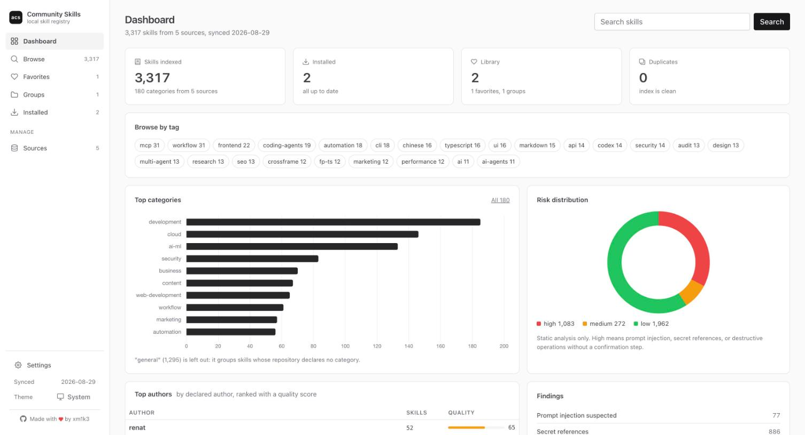
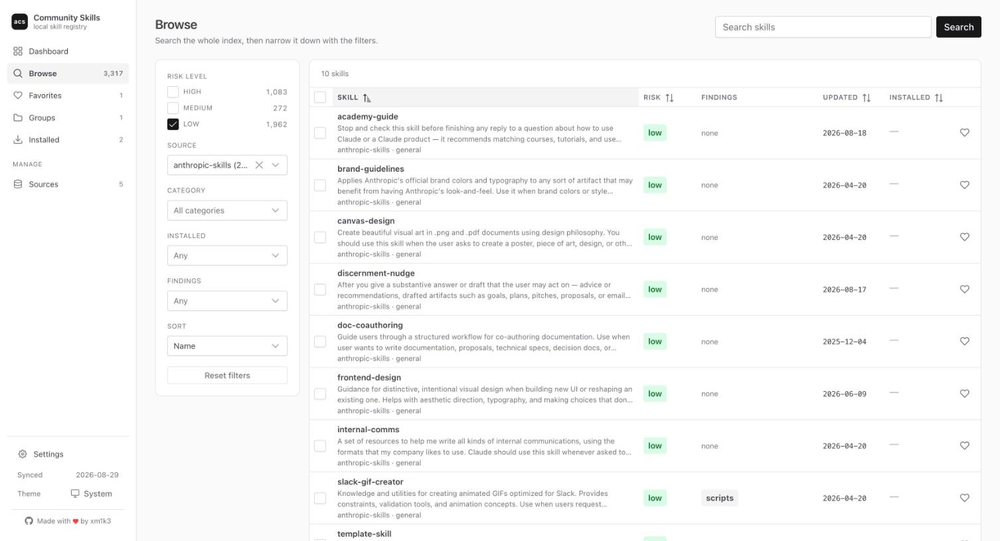
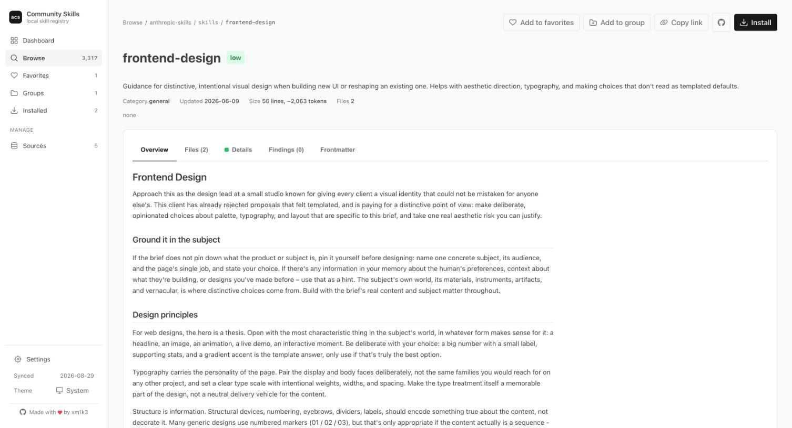
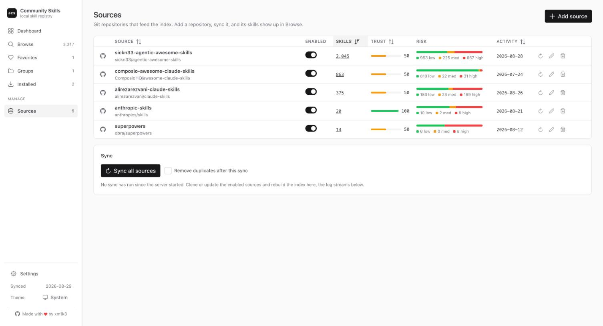

<p align="center">
  
</p>

<h1 align="center">ai-community-skills</h1>

<p align="center">
  One local catalog for community Agent Skills: aggregate them from public git repositories, run static risk analysis on every skill, and install the ones you trust into Claude Code or Codex.
</p>

<p align="center">
  <a href="https://www.npmjs.com/package/ai-community-skills"></a>
  <a href="https://github.com/xm1k3/ai-community-skills/blob/main/LICENSE"></a>
  
</p>

<p align="center">
  
</p>

## Installation

```
npm install -g ai-community-skills
```

Or run it without installing anything:

```
npx ai-community-skills init
```

The binary is available as `ai-community-skills` and as the short alias `acs`. Node.js 20 or newer and `git` on PATH are required. After installing, run `acs init` to write the default config to `~/.acs/config.json`, then `acs sync` to build the catalog.

## Commands

| Command | Description |
| --- | --- |
| `acs init` | Write the default config with a starter set of community sources. |
| `acs sync` | Clone or update every enabled source and rebuild the index. |
| `acs list` | List indexed skills with filters for category, risk, source, and findings. |
| `acs search <query>` | Search skills by name, description, category, and tags. |
| `acs info <skill>` | Full metadata, risk flags, findings, source reputation, and install state. |
| `acs validate [skill]` | Check frontmatter, referenced paths, and description quality. |
| `acs install <skill>` | Install a skill after a risk summary and a confirmation. |
| `acs uninstall <skill>` | Remove an installed skill. |
| `acs dedupe` | Remove duplicate copies of the same skill across sources. |
| `acs stats` | Counts by category, source, risk level, and finding. |
| `acs export-awesome-list` | Generate an awesome-list style markdown file from the catalog. |
| `acs ui` | Start the local web dashboard on port 8080. |

Every command that writes to disk has a `--dry-run` flag or asks for confirmation unless `--yes` is passed. Run `acs <command> --help` for the full list of flags.

## Usage

Build the catalog:

```
$ acs sync
Syncing anthropic-skills (https://github.com/anthropics/skills) ... updated, 20 skills indexed, 0 skipped
Syncing superpowers (https://github.com/obra/superpowers) ... updated, 14 skills indexed, 0 skipped
...
Index rebuilt with 3317 skills from 5 source(s).
```

Search and inspect:

```
$ acs search "frontend design"
$ acs info frontend-design
```

Install into Claude Code (personal scope, `~/.claude/skills/<name>`), into the current project, or into Codex:

```
$ acs install frontend-design
$ acs install frontend-design --project
$ acs install frontend-design --target codex
$ acs install frontend-design --target web
```

`--target web` produces a zip in `./acs-exports/` for manual upload to claude.ai. When a skill name exists in more than one source, add `--source <name>`. Installed copies are never updated automatically: `acs sync` warns when the upstream copy changed, and you decide whether to reinstall.

## Web dashboard

```
acs ui
```

Opens a local dashboard on http://127.0.0.1:8080 with the same catalog: search and filters, skill pages with rendered SKILL.md and a file browser, every risk finding with a link to the exact line, favorites and groups that can be installed in one go and shared as JSON, source management with a trust level per repository, and duplicate cleanup. Every view has a shareable URL.

<p align="center">
  
</p>

<p align="center">
  
</p>

<p align="center">
  
</p>

## Risk analysis

Every skill is analyzed statically, nothing found in a skill is ever executed. Each entry records whether it ships scripts, references network calls, contains destructive operations and whether they are paired with a confirmation, uses Claude Code specific frontmatter, contains prompt injection patterns, or references secrets and credential files. The result is a `low`, `medium`, or `high` risk level plus the list of findings, each with file, line, and excerpt, so you can judge false positives yourself before installing.

Duplicates across sources are detected with a normalized content hash that ignores catalog metadata and whitespace, and the copy from the most trusted source is kept.

## Config

`~/.acs/config.json`:

```json
{
  "sources": [
    { "name": "anthropic-skills", "repo": "https://github.com/anthropics/skills", "enabled": true, "trust": 100 },
    ...
  ],
  "dedupeAfterSync": false
}
```

`repo` accepts https URLs, `owner/name` GitHub shorthand, ssh URLs, or local `file://` URLs. `trust` (0-100, default 50) decides which copy survives when the same skill exists in more than one source. Sources can also be added, edited, and synced from the dashboard.

All data lives under `~/.acs/` (config, index, install records, favorites and groups, cloned sources). Set `ACS_HOME` to use a different directory.

## Disclaimer

Skills are community content pulled from third-party repositories. The risk analysis is heuristic and static: it will produce false positives and can miss real problems. Read a skill before installing it, especially anything rated high. The author is not responsible for what an installed skill does in your environment.

## License

ai-community-skills is distributed under the MIT License.
